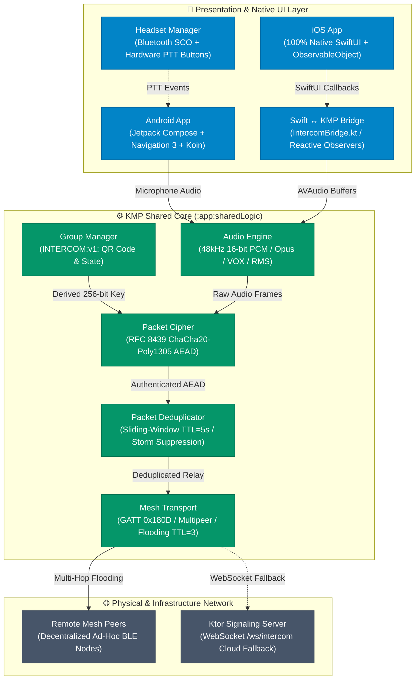

# System Architecture Document — Intercom-Alpha

> **Document Version:** 1.0  
> **Status:** Active / Engineering Ready  
> **Interactive Diagram:** [`docs/architecture/intercom-alpha-architecture.html`](file:///d:/Codes/Antigravity/Project4/Intercom-Alpha/docs/architecture/intercom-alpha-architecture.html)  
> **Obsidian Reference:** `02_Architecture/` & `ADRs/`

---

## 🏛️ 1. High-Level System Architecture

**Intercom-Alpha** is built as a Kotlin Multiplatform (KMP) monorepo that delivers high-performance, decentralized voice communication across Android and iOS devices.



> 💡 **Explore the Interactive Version:** Open [`docs/architecture/intercom-alpha-architecture.html`](file:///d:/Codes/Antigravity/Project4/Intercom-Alpha/docs/architecture/intercom-alpha-architecture.html) in your browser to experience animated route tracing, guided views, and theme switching.

---

## 📦 2. Monorepo Module Decomposition

| Module | Target Platforms | Responsibility |
| :--- | :--- | :--- |
| `:app:sharedLogic` | Common, Android, iOS Native, JVM, Wasm/JS | Core business logic: `AudioEngine`, `MeshTransport`, `PacketDeduplicator`, `PacketCipher`, `GroupManager`, `HeadsetManager`, `IntercomBridge`. |
| `:app:sharedUI` | Common, Android, Desktop (JVM) | Android and Desktop UI components, Compose theme tokens, `AppNavGraph` (Navigation 3), and Koin ViewModels (`HomeViewModel`). |
| `:app:androidApp` | Android (SDK 26–35) | Android entrypoint: `IntercomAlphaApplication`, `MainActivity`, Bluetooth permissions, and Foreground Service lifecycle. |
| `:app:iosApp` | iOS (iOS 16+) | **100% Native SwiftUI** application: `ContentView.swift`, `IntercomViewModel.swift`, `QrScannerView.swift`, and AVFoundation camera/audio taps. |
| `:core` | Common, Android, iOS, JVM | Shared polymorphic protocol contracts: `SignalingProtocol.kt` (SignalingFrame, PeerStatus, RoomState). |
| `:server` | JVM (Ktor Server) | Standalone Ktor WebSocket signaling server (`/ws/intercom`) retained for cloud fallback and SFU audio relay (ADR-009). |

---

## 🛡️ 3. Critical Platform Isolation Decisions

### 3.1 Strict Platform Rule: No Shared UI on iOS (ADR-004)
- **Directive**: Compose Multiplatform is **NOT** used for the iOS target.
- **Implementation**: The iOS client resides entirely in `app/iosApp` as a modern, 100% native SwiftUI project.
- **Bridge Architecture**: The Swift UI layer communicates with shared KMP logic exclusively via `IntercomBridge.kt` (`app/sharedLogic/src/iosMain`), which provides non-blocking, memory-safe callback observers (`CancellationHandle`).

### 3.2 Dependency Injection & Navigation (Android & SharedUI)
- **Dependency Injection**: **Koin Multiplatform 4.0.2** (`koin-core`, `koin-android`, `koin-compose`, `koin-compose-viewmodel`).
- **Navigation**: **Jetpack Navigation 3** (`androidx.navigation3.ui.NavDisplay` / `rememberNavBackStack`) with polymorphic serialization registration in `SavedStateConfiguration`.

---

## ⚙️ 4. Subsystem Deep Dive

### 4.1 Audio Engine (`AudioEngine.kt`)
- **Sampling & Bit Depth**: 48,000 Hz, 16-bit PCM little-endian, mono channel.
- **VOX Thresholding**: RMS power calculation in dBFS; transmission triggers when signal exceeds configured threshold (e.g., -40 dB) with a 300ms hangover decay window.
- **RMS Volume Metering**: Live power calculation normalized to `0.0 .. 1.0` and emitted via `ReceiveChannel<Float>`.
- **Platform Implementation**:
  - **Android**: `AudioRecord` (16-bit PCM, `AudioSource.VOICE_COMMUNICATION`) + `AudioTrack` with Bluetooth SCO stream routing.
  - **iOS**: `AVAudioEngine` input node tap + `AVAudioPlayerNode` with dynamic buffer scheduling under `AVAudioSessionCategoryPlayAndRecord` (VoiceChat mode).

### 4.2 BLE GATT Mesh Transport (`MeshTransport.kt`)
- **GATT Service UUID**: `0000180d-0000-1000-8000-00805f9b34fb`
- **GATT Characteristic UUID**: `00002a37-0000-1000-8000-00805f9b34fb` (Properties: Write Without Response, Notify).
- **Simultaneous Dual Role**: Devices run both a BLE GATT Server (advertising service UUID) and a BLE GATT Central (scanning for peers).
- **iOS Local Mesh Bridge**: In addition to CoreBluetooth GATT, iOS devices leverage `MultipeerConnectivity` (`MCSession`) for high-throughput, low-latency local P2P Wi-Fi/BLE bridging.

### 4.3 Multi-Hop Flooding Relay & Loop Suppression
```
[Peer A] ──(TTL=3)──> [Relay B] ──(TTL=2)──> [Peer C] ──(TTL=1)──> [Peer D (Drop)]
```
1. **TTL Decrement**: Each relay node decrements packet TTL (`ttl - 1`). If `ttl > 1`, the packet is re-broadcasted to all other connected peers, excluding the immediate sender.
2. **Local Delivery**: Relay nodes immediately extract the inner payload from `MeshPacket.Relay` and deliver it to their local `incomingAudio` or `incomingControl` channels.
3. **Sliding-Window Deduplicator (`PacketDeduplicator.kt`)**: Tracks composite keys:
   - `audio:senderId:sequence`
   - `ctrl:senderId:type:payloadHash`
   - `relay:originalSenderId:innerKey`  
   Duplicate arrivals within a 5,000ms TTL window are dropped before processing or re-transmitting.

### 4.4 End-to-End AEAD Encryption (`PacketCipher.kt`)
- **Standard**: RFC 8439 ChaCha20-Poly1305 Authenticated Encryption with Associated Data (AEAD).
- **Zero Platform Dependencies**: 100% pure Kotlin implementation (20-round ChaCha20 stream cipher, Bernstein 26-bit limb Poly1305 authenticator mod $2^{130}-5$).
- **Key Derivation**: 256-bit symmetric group key derived from the offline QR invite secret using FIPS 180-4 SHA-256.
- **Wire Format**:
  $$\text{Payload} = \text{Nonce (12B)} \parallel \text{Ciphertext (NB)} \parallel \text{Poly1305 Tag (16B)}$$

---

## 📡 5. Protocol & Packet Specification

All packets inherit from the polymorphic sealed hierarchy `MeshPacket` and serialize via `kotlinx.serialization` with `classDiscriminator = "#type"`:

```kotlin
@Serializable
sealed class MeshPacket {
    @Serializable
    data class Audio(
        val senderId: String,
        val sequence: Long,
        val timestamp: Long,
        val data: ByteArray,
        val profile: AudioProfile
    ) : MeshPacket()

    @Serializable
    data class Control(
        val senderId: String,
        val type: ControlType,
        val payload: ByteArray = ByteArray(0)
    ) : MeshPacket()

    @Serializable
    data class Discovery(
        val senderId: String,
        val groupId: String,
        val peerName: String,
        val capabilities: Capabilities
    ) : MeshPacket()

    @Serializable
    data class Relay(
        val originalSenderId: String,
        val ttl: Int,
        val packet: MeshPacket
    ) : MeshPacket()
}
```

---

## 🔒 6. Security & Threat Model

1. **Eavesdropping on Intermediate Hops**: Mitigated by ChaCha20-Poly1305. Intermediate relay nodes inspect only `MeshPacket.Relay(originalSenderId, ttl)` to route packets, while voice payloads remain cryptographically sealed.
2. **Replay & Broadcast Flooding Attacks**: Mitigated by `PacketDeduplicator` timestamp windows and sequence number checking.
3. **Impersonation**: Mitigated by pre-shared group secrets exchanged out-of-band via physical QR code scanning (`INTERCOM:v1:`).
